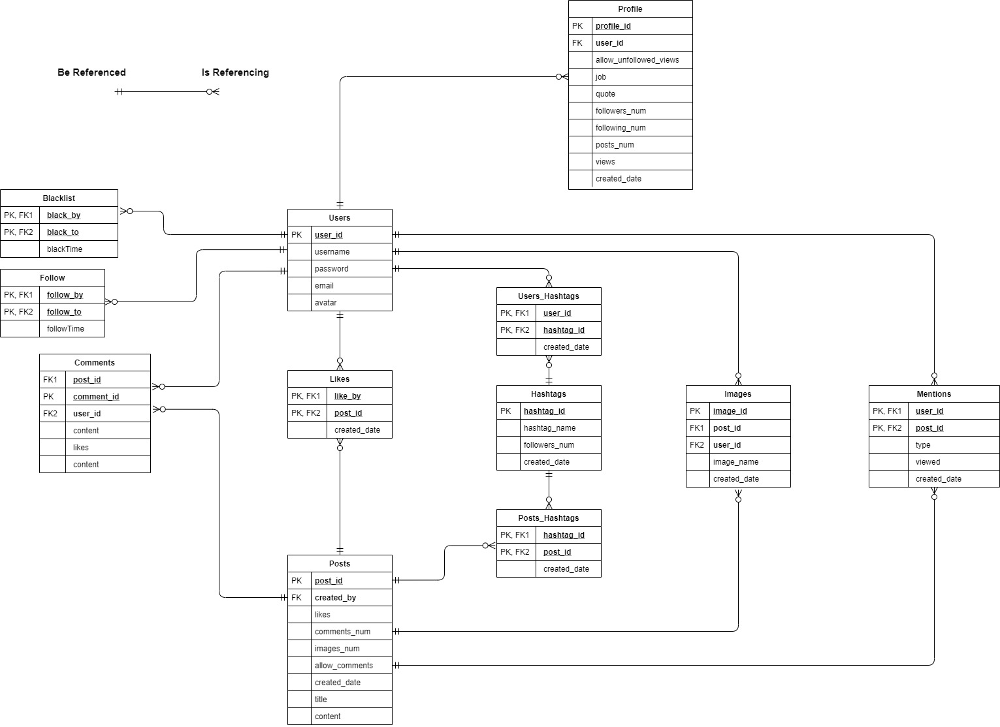
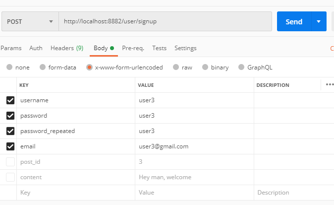
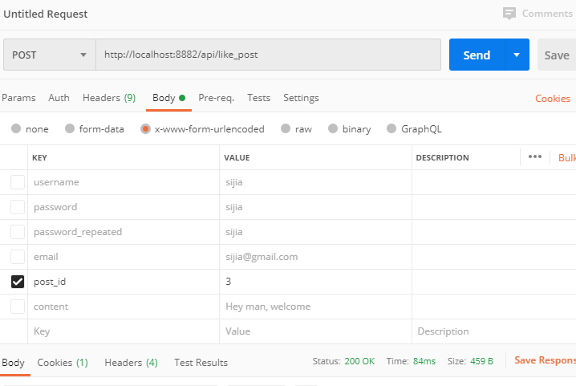
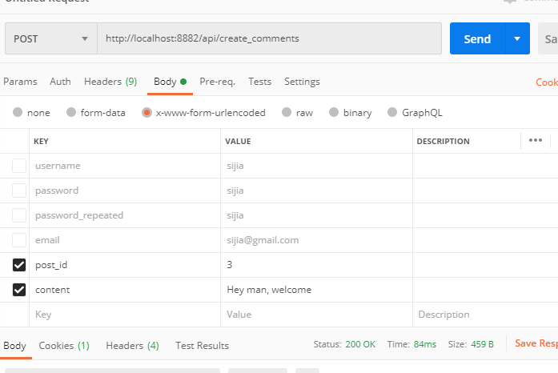

# YouTube Demo

https://www.youtube.com/watch?v=2yY3wGJEdnM

# Golang Social Network API

Github URL: https://github.com/LeonSijiaLu/Sijia-s-Work-Repo/tree/master/Golang/Golang-Social-Network

```
Install Go on Red Hat Linux

rpm --import https://mirror.go-repo.io/centos-unstable/RPM-GPG-KEY-GO-REPO
curl -s https://mirror.go-repo.io/centos-unstable/go-repo-unstable.repo | tee /etc/yum.repos.d/go-repo-unstable.repo
yum install golang
```

## Intro

This is the code my social network "TypInBlog", the backend API is made in Golang, and frontend is made in Jquery

Below is the database design: 



## Tables

`Users`: It stores user login information

`Profile`: Additional user information, you can decide if you want strangers or followers-only to view your posts

`Likes`: It stores who liked which post

`Posts`: Posts information, you can decide if this posts allow comments

`Comments`: Comments information, which posts it belongs to and who wrote it

`Images`: Real images are uploaded to the file server constructed in Go, images metadata is stored in this table

`Blacklist`: Who blocked whom

`Follow`: Who follows whom

`Mentions`: Who mentions whom, it is done using `@` like `@Leon`

`Hashtags`: Hashtags information, like its total posts number, followers number, hashtag name. Hashtag is created using `#...#` like `#FirstPost#` in posts

`Users_Hashtags`: Who followed this hashtag

`Posts_Hashtags`: Which posts has this hashtag

## How to run ?

```
apt-get install -y go 
go get github.com/gin-gonic/gin
go get github.com/badoux/checkmail
go get golang.org/x/crypto/bcrypt
go get github.com/go-sql-driver/mysql
go get github.com/gorilla/sessions
go get github.com/urfave/negroni

Then put all files under: src folder of GOPATH (/root/go/src on Red Hat Linux)

The DB name is `socialnet`, username is `netadmin_s96lu` and password is `netadmin_s96lu`. If you want to change DB name or username or password, please change them at the beginning of `db.sql` and `./utils/db.go` which is the go code to connect to mysql

`mysql socialnet < db.sql` to import database into mysql

Then in `./utils/db.go`, you can manage database name, database IP, username and password. 
```

## Something to say before

I used only `GET` and `POST` request. 

## What it allows you to do

In order to navigate what is available for you, you need to first: 

I created a lot of APIs, please see `main.go` for all of them

1. `http://localhost:8882/user/signup`: `POST Request`, enter `username`, `password`, `password_repeated`, `email` to signup



2. `http://localhost:8882/user/login`: `POST Request`, enter `username`, `password` to let you login

3. `http://localhost:8882/user/logout`: `POST Request`, It lets you logout instantly

* The rest part requires you to login, since the code stores your session data, please do not log out !! I have populated the database for you. `Password` is encrypted, but it is the same as the username. 

Please enjoy :)

### Posts

4. `http://localhost:8882/api/post`: `POST Request`, enter `title`, `content` to upload posts. In the `content` section, 

If your content is `#Welcome# this is my first post. @user1 Thanks for inviting me`. 

a. `#Welcome#` please use two hashtags to make a hashtag topic. <br />

b. `@user1` use one `@` to indicate mentioning people. <br />

* You can set this post to `allow_comments = true` to allow comments which is the default setting
* If `allow_comments = false` to disallow comments, then this post cannot be commented, and comments already made will not be shown

5. `http://localhost:8882/api/post/12`: `DELETE Request`, it will delete post 12 and created by YOU

6. `http://localhost:8882/api/post/12`: `PUT Request`, enter `title`, `content`, `allow_comments` to update post 12. Set `allow_comments == 1` allows comments, set `allow_comments == 0` disallows comments

7. `http://localhost:8882/api/like_post`: `POST Request`, enter `post_id` in the post request. Then your `user_id` and the `post_id` will be stored in `Likes`, and the likes number of this post will also increment



8. `http://localhost:8882/api/unlike_post`: `POST Request`, enter `post_id` to dislike. 

9. `http://localhost:8882/api/comments/12`: `POST Request`, enter `content`, then it creates a comment for post with id 12. 



10. `http://localhost:8882/api/comments/12/2`: `PUT Request`, enter `content`, then it will edit the content of the 2nd comments of post with id 12. 

11. `http://localhost:8882/api/follow_user`: `POST Request`, enter `username`

12. `http://localhost:8882/api/unfollow_user`: `POST Request`, enter `username`

13. `http://localhost:8882/api/blacklist_user`: `POST Request`, enter `username` to blacklist this user. Then 

a. `this user will not be able to see your profile`  <br />
b. `this user will not be able to see any of your new posts through http://localhost:8882/api/explore where latest posts of your followings are shown`  <br />
c. `this user will not be able to see any of your new posts through http://localhost:8882/api/explore_hashtag_posts where latest posts of the hashtag are shown`  <br />

14. `http://localhost:8882/api/unblacklist_user`: `POST Request`, enter `username` to unblacklist this user

15. `http://localhost:8882/api/profile/2`: `GET Request`, this url displays the profile of user_id = 2. You can only see the profile if you are not blocked. If the owner set allow_unfollowed_views = false, then you have to be a follower of the owner to view profile

16. `http://localhost:8882/api/profile`: `POST Request`, enter `job`, `quote`, `allow_unfollowed_views` to edit your profile

17. `http://localhost:8882/api/follow_hashtag`: `POST Request`, enter `hashtag_name` to follow this hashtag

18. `http://localhost:8882/api/unfollow_hashtag`: `POST Request`, enter `hashtag_name` to unfollow this hashtag

### Explore

The above part mainly focuses a specific attempt, for example, creating, deleting, updating or following. However, this `Explore` part focuses on viewing

19. `http://localhost:8882/api/explore`: `GET Request`, it displays the latest posts of people who you are following. You cannot see people's posts who blocked you

20. `http://localhost:8882/api/explore_hashtag_posts/HASHTAGNAME`: `GET Request`, enter `HASHTAGNAME` is the hashtag name you want to search. It views the hottest posts of the hashtags you followed. You cannot see people's posts who blocked you. And if a post is set as private, you must be a follower you visit.  